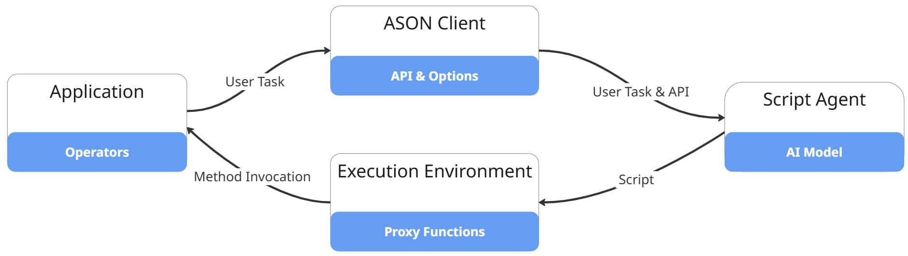
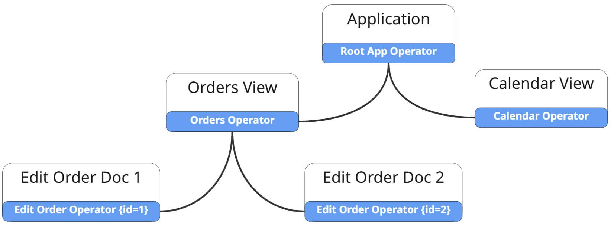
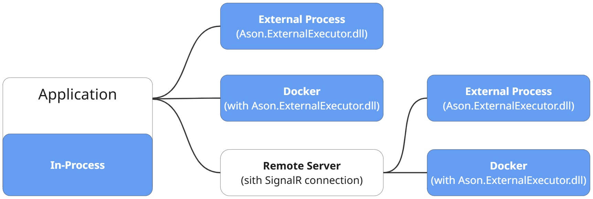
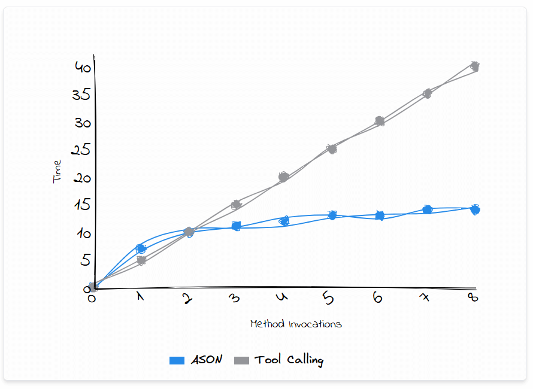

# ASON (Agent Script Operation)


**ASON** is a library that enables AI models to generate scripts and execute sequences of functions in your application based on natural language user requests. Unlike traditional **MCP** or **tool-calling** mechanisms, ASON generates and runs complete scripts in a single pass.

This architecture makes it possible to handle multi-step data editing, analytical requests (for example, building dynamic charts from your data), or extracting information from large data sources. No complex infrastructure is required — ASON provides a simple entry point for powerful AI integration.

ASON offers greater flexibility, performance, and efficiency when bringing AI into your applications. For more details, see [Benefits of ASON over Tool Calling / MCP](#benefits-of-ason-over-tool-calling--mcp).

> [!Note]
> ASON is a new library, and its public API may change in future versions. If you’d like to see ASON continue to grow, please show your support by **giving it a star!**

## Online Demo

You can try out ASON in a live sample app here (currently hosted on a free Azure plan, so usage limits may apply):  [**ASON Demo**](https://ason-demo-linux-hegxhud6c8cmfkfm.centralus-01.azurewebsites.net/)

The **source code** for the demo is available on GitHub: [ason-demo](https://github.com/Alexgoon/ason-demo)

**Intro Video:** [ASON – Actionable AI in .NET Apps (Intro & Demo)](https://youtu.be/dKBkVTl3e_c?si=N0zoIE1EAnC6KoS1)  [](https://youtu.be/dKBkVTl3e_c?si=N0zoIE1EAnC6KoS1)


## Quick start

**1. Install ASON project templates**

```
> dotnet new install Ason.ProjectTemplates
```

**2. Create a project**
You can create a Blazor, WPF, WinForms, MAUI, or Console application:

```
> dotnet new ason.blaz.srv -n MyAsonProject
```

Instead of `ason.blaz.srv`, you can use `ason.wpf`, `ason.winforms`, `ason.maui`, or `ason.console`.

**3. Configure your AI provider**

Specify your AI provider API key (for example, OpenAI) or use **Ollama** for locally hosted models (recommended only if your hardware can support a large model such as `gpt-oss-120b`).

In the project templates, the API key is defined as follows:
```csharp
var apiKey = Environment.GetEnvironmentVariable("MY_OPEN_AI_KEY") ?? string.Empty;
```
The templates use `OpenAIChatCompletionService` to connect to OpenAI.  
However, you can also use other services supported by **Semantic Kernel** (see: [Chat Completion | Overview](https://learn.microsoft.com/en-us/semantic-kernel/concepts/ai-services/chat-completion/?tabs=csharp-Google%2Cpython-AzureOpenAI%2Cjava-AzureOpenAI&pivots=programming-language-csharp)).

---

## How ASON works

Below is a simplified overview of the ASON architecture.


1. Your application defines **operators** that execute methods in your code.  
2. The **ASON Client** creates APIs (operator signatures) and passes them to the **Script Agent** along with the user’s task.  
3. The **Script Agent** generates a script and sends it to the **execution environment** (same process, external process, Docker container, or remote server).  
4. The **execution environment** calls dynamically generated proxies that invoke real operator methods.


## Operators

An **operator** is a class that contains methods exposed to the Script Agent.  
To define an operator, create a class that inherits from `OperatorBase`.  
Apply the `[AsonOperator]` attribute to the class and `[AsonMethod]` to each method you want to expose.

Example:

```csharp
[AsonOperator]  
public class OrdersViewOperator : OperatorBase<OrdersViewModel> {  
    [AsonMethod]  
    public void DeleteOrder(int orderId) => AttachedObject?.DeleteOrder(orderId);  
}
```

Operators are attached to objects that contain business logic.  These objects are stored in the `AttachedObject` property.

To attach an operator to an object, call `AttachChildOperator`:

```csharp
public partial class OrdersViewModel {  
    public void DeleteOrder(int orderId) => Debug.WriteLine($"Deleted order {orderId}");  
    public OrdersViewModel(RootOperator rootOperator) {  
        rootOperator.AttachChildOperator<OrdersViewOperator>(this);  
    }  
}
```

### Root operator

Your application must contain a **root operator** that inherits from `RootOperator`.  
It typically includes methods for returning child operators or accessing globally available APIs.

Example:

```csharp
[AsonOperator]  
public class MainAppOperator : RootOperator<MainViewModel> {  
    public MainAppOperator(MainViewModel attachedObject) : base(attachedObject) { }  

    [AsonMethod]  
    public async Task<OrdersViewOperator> GetOrdersViewOperatorAsync() =>  
        await GetViewOperator<OrdersViewOperator>(AttachedObject.Navigate<OrdersViewModel>);  

    [AsonMethod]  
    public async Task<IEnumerable<Setting>> GetApplicationSettingsAsync() =>  
        await AttachedObject.GetSettings();  
}
```

> [!Note]  
> You don’t need to call `AttachChildOperator` for the root operator. It’s automatically attached when you pass an object to the constructor.

### Operator relationships

Each operator contains APIs related to a specific **view**, **module**, or **service**.  
A parent operator can create child operators using the `OperatorBase.GetViewOperator` method.



> [!Note]
> Always use `GetViewOperator` to create child operators — never instantiate them directly.

You must pass a navigation function to `GetViewOperator` so that the operator knows how to navigate or open a view when called.

This architecture ensures that generated scripts call operator methods only when the corresponding view or model is active.  
For example, if a script applies a filter to a Data Grid with orders, it will navigate to the Orders View, wait until the grid is loaded, and then call the appropriate method.

The `AttachChildOperator` method notifies the parent operator that the child is ready and its methods can be invoked.  
If your operator depends on UI elements or their data, call `AttachChildOperator` when the view is rendered or its data is loaded.  
When the associated object is destroyed, call `DetachChildOperator`.

---

## Domain model

ASON allows you to expose models as part of the API used by the Script Agent.  
To add a model to your API, apply the `[AsonModel]` attribute to a class.

```csharp
[AsonModel]  
public class Order {  
    public int OrderId { get; set; }  
    public DateTime OrderDate { get; set; }  
}
```

This enables ASON to generate scripts that use the `Order` model and automatically handle serialization and deserialization between the client and the execution environment.

---

## Configure a client and send a task

To send tasks to ASON, create an instance of `AsonClient`:

```csharp
IChatCompletionService chatService = new OpenAIChatCompletionService(modelId: "gpt-4.1-mini", apiKey: apiKey);  
OperatorsLibrary operatorLibrary = new OperatorBuilder()  
    .AddAssemblies(typeof(MainAppOperator).Assembly)  
    .Build();  

mainAppOperator = new MainAppOperator(this);  

AsonClientOptions options = new() {  
    ExecutionMode = ExecutionMode.ExternalProcess  
};  

asonChatClient = new AsonClient(chatService, mainAppOperator, operatorLibrary, options);
```

**Constructor parameters:**

- `IChatCompletionService defaultChatCompletion` — A chat completion service used by ASON agents. Supports OpenAI, Azure, Gemini, Ollama, Anthropic, and other providers supported by Semantic Kernel (see: [Chat Completion | Overview](https://learn.microsoft.com/en-us/semantic-kernel/concepts/ai-services/chat-completion/?tabs=csharp-Google%2Cpython-AzureOpenAI%2Cjava-AzureOpenAI&pivots=programming-language-csharp)).  
- `RootOperator rootOperator` — An instance of your root application operator.  
- `OperatorsLibrary operators` — A library of operators created by `OperatorBuilder`.  
- `AsonClientOptions options` — Defines the execution environment, allows prompt overrides, custom agent configurations, and other behaviors.

Once an `AsonClient` is created, you can send a user task using the `SendStreamingAsync` or `SendAsync` method:

```csharp
await foreach (var token in asonChatClient.SendStreamingAsync(userText)) {  
    ChatResponse += token;  
}  

// or  

ChatResponse = await asonChatClient.SendAsync(userText);
```

## Service registration (ASP.NET Core / Blazor)

You can register `AsonClient` as a scoped dependency in your service container using `AddAson`:

```csharp
builder.Services.AddAson(  
    defaultChatCompletionFactory: sp => new OpenAIChatCompletionService("gpt-4.1-mini", Environment.GetEnvironmentVariable("MY_OPEN_AI_KEY") ?? string.Empty),  
    rootOperatorFactory: sp => sp.GetRequiredService().MainAppOperator,  
    operators: new OperatorBuilder()  
        .AddAssemblies(typeof(BlazorMainAppOperator).Assembly)  
        .AddExtractor()  
        .Build(),  
    configureOptions: opt => {  
        opt.RunnerMode = ExecutionMode.Docker;  
    }  
);
```

## Execution modes / environments

- **In-process** – Scripts run in the same process as your application.  
  Ideal for development and testing, but not recommended for production due to limited isolation.  
  ASON includes static analysis to block unsafe operations (reflection, file I/O, networking, etc.).

- **External process** – Scripts run in a separate process, providing an extra layer of protection.  
  Add the `Ason.ExternalExecutor` NuGet package to enable this mode.

- **Docker** – Scripts execute inside a fully isolated container for maximum security.  
  Requires Docker installed locally.  
  Pull the required container before running the app:

  > docker pull ghcr.io/alexgoon/ason:0.8.1

- **Remote server** – Scripts execute on a remote server, either in an external process or Docker container.  
  See the next section for configuration details.
  


## Remote execution

You can run ASON scripts on a **remote server**, which is especially useful for mobile clients or when Docker is unavailable on a user machine.

To enable remote execution:

1. Create a standard **ASP.NET Core Web API** project and install the `Ason.RemoteBridge` NuGet package.  
2. In `Program.cs`, register the script runner:

```csharp
builder.Services.AddAsonScriptRunner();  
app.MapAson("/scriptRunnerHub", requireAuthorization: false);
```

3. In the client application, enable the remote runner in `AsonClientOptions`:

```csharp
AsonClientOptions options = new() {  
    ExecutionMode = ExecutionMode.ExternalProcess,  
    RemoteRunnerBaseUrl = "http://localhost:5222",  
    UseRemoteRunner = true,  
};
```

A sample project demonstrating this setup is included in the **MAUI Project Template**.


## ASON agents

ASON uses multiple internal AI agents to coordinate the workflow, generate scripts, extract data, and explain results:

- **Reception Agent** – Accepts the conversation thread and prepares input information for the Script Agent.  
  You can skip it by setting `AsonClientOptions.SkipReceptionAgent` to `true`.

- **Script Agent** – Generates the script based on the user task and available API.

- **Extractor Agent** – Extracts data from unstructured text.  
  The Script Agent can use it when a task involves parsing text, such as extracting a company name from an email.  
  Enable it with `OperatorBuilder.AddExtractor`.

- **Explainer Agent** – Explains the results of an executed script based on the original user request.  
  You can disable it by setting `AsonClientOptions.SkipExplainerAgent` to `true`.


## MCP integration

ASON scripts can invoke functions from **MCP servers** using the [MCP C# SDK](https://github.com/modelcontextprotocol/csharp-sdk).  
To expose MCP methods to ASON scripts, call `OperatorBuilder.AddMcp` and pass an MCP client instance.

Example workflow:

```csharp
async Task<McpClient> CreateContext7ClientAsync() {
    var httpClient = new HttpClient();
    httpClient.DefaultRequestHeaders.Add("CONTEXT7_API_KEY", Environment.GetEnvironmentVariable("CONTEXT7_API_KEY"));

    return await McpClient.CreateAsync(
        new HttpClientTransport(new HttpClientTransportOptions {
            Endpoint = new Uri("https://mcp.context7.com/mcp")
        }, httpClient));
}

var context7Client = await CreateContext7ClientAsync();  
var operatorLibrary = new OperatorBuilder()  
    .AddAssemblies(typeof(MainAppOperator).Assembly)  
    .AddMcp(context7Client)  
    .Build();
```

## Logging

ASON provides centralized logging via the `AsonClient.Log` event, which reports activity from all execution levels.

```csharp
asonChatClient.Log += (o, e) => Debug.WriteLine($"{e.Source}: {e.Message}");
```

This helps track generated scripts, capture errors, and monitor runtime events from both client and execution environments.

`AsonLogEventArgs` includes the following properties:

- `Level`  
- `Message`  
- `Exception`  
- `Source`

---

## Benefits of ASON over Tool Calling / MCP

### Flexible logic

ASON can handle more complex workflows than traditional tool-calling systems or standalone MCP servers.  
It provides access to your model entities and can chain multiple method calls in a single AI-generated script.

**Example scenario:**  A user asks your system to update the status of all leads created before June 2024 to *Inactive*.

#### Traditional approach (MCP / Tool Calling)

You would typically define specialized methods such as `GetLeadsBeforeDate(date)` and `UpdateLeadsStatus(leadIds, newStatus)`.  

1. The user’s request is passed to the LLM along with all available tools.  
2. The LLM analyzes the request and available tools, then decides to call `GetLeadsBeforeDate` with a specific date as a parameter.  
3. Your application executes the `GetLeadsBeforeDate` method.  
4. The results are passed back to the LLM (the entire collection returned by `GetLeadsBeforeDate`).  
5. The LLM then decides to call `UpdateLeadsStatus` using the IDs obtained from the previous step.  
6. Your application executes the `UpdateLeadsStatus` method.  
7. Finally, the LLM generates the text output.  

If the user later modifies their request, these methods may no longer fit — requiring you to add new ones or make existing ones more generic, which increases the risk of invalid LLM-generated input. Also note that in step 4, the entire result set must be passed to the LLM so it can construct parameters for step 5.


#### ASON approach

ASON dynamically generates and executes a script to complete the task. For example, it might retrieve leads created before a certain date, update their status to *Inactive*, and then save changes back using available model methods. 

```csharp
var cutoffDate = new DateTime(2024, 6, 1);

leadsOperator.GetLeads()
    .Where(lead => lead.CreatedDate < cutoffDate)
    .ToList()
    .ForEach(lead =>
    {
        lead.Status = "Inactive";
        leadsOperator.UpdateLead(lead);
    });
```
 
ASON understands your model (for example, `Lead`) and available operations (such as `GetLeads` and `UpdateLead`), allowing the AI to compose flexible logic on the fly.


### Performance

With traditional MCP or tool-calling systems, **each tool call triggers a separate LLM request**.  
For example, if you expose a `DeleteOrder` method and a user asks to delete 10 orders, your client must make at least 10 LLM round trips — significantly impacting performance.

ASON, by contrast, generates a single script and executes it **without further LLM involvement**. 

```csharp
var lastOrders = ordersOperator.GetOrders()
    .OrderByDescending(o => o.CreatedDate)
    .Take(10);

foreach (var order in lastOrders)
{
    ordersOperator.DeleteOrder(order);
}
```

It can, for instance, obtain a list of recent orders and delete them all in one locally executed script.

This reduces network latency and token usage while improving throughput for large-scale operations.



### Token usage and API capacity

AI services typically charge based on token consumption.  
Traditional tool-calling mechanisms often waste tokens due to the following reasons:

- **Large data processing:**  
  When an AI tool (for example, *GetOrders*) returns thousands of records, the LLM must handle all the data, quickly consuming token limits.
- **Full tool descriptions on each request:**  
  Each tool call includes the full definition and description of every available tool, even if most are unused.

ASON eliminates both issues.  
Once a script is generated, it executes locally — **without additional LLM calls** — allowing unlimited data processing without extra token costs.

ASON also provides a **compact API model** where the LLM receives concise method signatures represented as code. 

```csharp
public class BarValue
{
    public string Caption;
    public double Value;
}

public class ChartsViewOperator
{
    private ChartsViewOperator();
    public void CreateBarChart(BarValue[] barValues, string xAxisCaption, string yAxisCaption);
}
```

Since LLMs are trained on programming syntax, they easily understand and operate with such APIs — enabling robust, context-aware script generation even for APIs with hundreds of methods.
